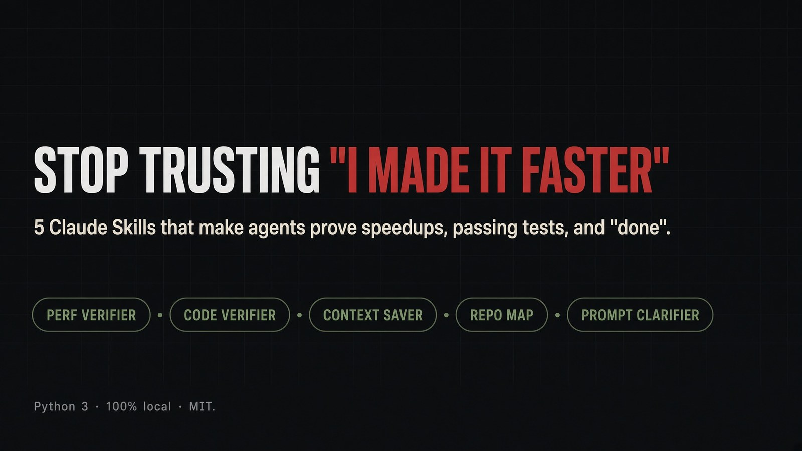

# Don't trust "I made it faster"

Five [Claude Code](https://code.claude.com) / [Agent Skills](https://agentskills.io/specification) that make the agent **measure, map, save context, clarify, and verify** instead of performing confidence.

<p align="center">
  
</p>

> Coding agents love claiming fake speedups. In a 30-run study cited by `perf-verifier`, only about **6%** of patches labelled "faster" were measurably faster. Independent testing cited by `code-verifier` found close to **half** of AI-written samples trip an OWASP Top-10 issue. This repo is the receipt.

[](LICENSE)
[](https://github.com/David-Florian2013/Stop-trusting-made-it-faster-here-is-5-best-skills-for-Claude-/releases)
[](https://www.python.org/)

**Requires:** an agent that loads `SKILL.md` (Claude Code, Cursor, Codex, …) · Python 3 on PATH for the three CLIs · Linux or macOS for `perf-verifier` · git for before/after checks.

[Install](#install) · [Download one skill](#download-one-skill) · [The five skills](#the-five-skills) · [vs default Claude](#vs-default-claude) · [Quick start](#quick-start)

---

## Install

Pick one path. All of them land **named folders** (`perf-verifier/`, not this whole git repo) under `~/.claude/skills/` or `.claude/skills/`.

### All five — Claude Code plugin

```text
/plugin marketplace add David-Florian2013/Stop-trusting-made-it-faster-here-is-5-best-skills-for-Claude-
/plugin install dont-trust-faster@dont-trust-faster
```

### All five — any Agent Skills host

```bash
npx skills add David-Florian2013/Stop-trusting-made-it-faster-here-is-5-best-skills-for-Claude-
```

Or with the GitHub CLI:

```bash
gh skill install David-Florian2013/Stop-trusting-made-it-faster-here-is-5-best-skills-for-Claude- --all
```

### All five — copy folders

```bash
git clone --depth 1 https://github.com/David-Florian2013/Stop-trusting-made-it-faster-here-is-5-best-skills-for-Claude-.git
cd Stop-trusting-made-it-faster-here-is-5-best-skills-for-Claude-
./install.sh
```

`./install.sh perf-verifier` installs just that one. Restart the agent session after install.

**Do not** `git clone` this repository into `~/.claude/skills/perf-verifier`. That nests five skills plus git metadata inside one skill name. Claude will not load them.

---

## Download one skill

Each skill is independently installable. Use the command, or grab the `.skill` zip (a zip whose top-level folder contains `SKILL.md` — the shape Claude.ai upload expects).

| Skill | Install this one | Download |
| --- | --- | --- |
| **perf-verifier** | `npx skills add David-Florian2013/Stop-trusting-made-it-faster-here-is-5-best-skills-for-Claude- --skill perf-verifier` | [perf-verifier.skill](https://github.com/David-Florian2013/Stop-trusting-made-it-faster-here-is-5-best-skills-for-Claude-/releases/latest/download/perf-verifier.skill) |
| **code-verifier** | `npx skills add David-Florian2013/Stop-trusting-made-it-faster-here-is-5-best-skills-for-Claude- --skill code-verifier` | [code-verifier.skill](https://github.com/David-Florian2013/Stop-trusting-made-it-faster-here-is-5-best-skills-for-Claude-/releases/latest/download/code-verifier.skill) |
| **context-saver** | `npx skills add David-Florian2013/Stop-trusting-made-it-faster-here-is-5-best-skills-for-Claude- --skill context-saver` | [context-saver.skill](https://github.com/David-Florian2013/Stop-trusting-made-it-faster-here-is-5-best-skills-for-Claude-/releases/latest/download/context-saver.skill) |
| **repo-map** | `npx skills add David-Florian2013/Stop-trusting-made-it-faster-here-is-5-best-skills-for-Claude- --skill repo-map` | [repo-map.skill](https://github.com/David-Florian2013/Stop-trusting-made-it-faster-here-is-5-best-skills-for-Claude-/releases/latest/download/repo-map.skill) |
| **prompt-clarifier** | `npx skills add David-Florian2013/Stop-trusting-made-it-faster-here-is-5-best-skills-for-Claude- --skill prompt-clarifier` | [prompt-clarifier.skill](https://github.com/David-Florian2013/Stop-trusting-made-it-faster-here-is-5-best-skills-for-Claude-/releases/latest/download/prompt-clarifier.skill) |
| **all five** | `npx skills add David-Florian2013/Stop-trusting-made-it-faster-here-is-5-best-skills-for-Claude-` | [all-skills.zip](https://github.com/David-Florian2013/Stop-trusting-made-it-faster-here-is-5-best-skills-for-Claude-/releases/latest/download/all-skills.zip) |

Same files also live in [`packaged/`](packaged/) on `main`.

### Claude.ai (web / desktop)

1. Enable **Settings → Capabilities → Code execution and file creation**.
2. **Customize → Skills → Upload a skill**.
3. Upload one `.skill` file from the table above (one skill per upload).

### Unzip a `.skill` into Claude Code by hand

```bash
mkdir -p ~/.claude/skills
SKILL=perf-verifier   # or code-verifier | context-saver | repo-map | prompt-clarifier
curl -fsSL -o /tmp/${SKILL}.skill \
  "https://github.com/David-Florian2013/Stop-trusting-made-it-faster-here-is-5-best-skills-for-Claude-/releases/latest/download/${SKILL}.skill"
unzip -o /tmp/${SKILL}.skill -d ~/.claude/skills
```

---

## The five skills

| Skill | Use when | What you get | Needs |
| --- | --- | --- | --- |
| **[perf-verifier](skills/perf-verifier/SKILL.md)** | "make it faster", loops, queries, large inputs | Profile → before/after + statistical test → output-same check → scaling curve. No speedup claim without a number. | Python 3 · [`pf.py`](skills/perf-verifier/scripts/pf.py) |
| **[code-verifier](skills/code-verifier/SKILL.md)** | After any code edit, before "done" | Receipt: syntax, imports (hallucinated packages), security scan, test-tamper, tests, lint, types. `FAIL` blocks "done." | Python 3 · [`vf.py`](skills/code-verifier/scripts/vf.py) · `node` optional |
| **[context-saver](skills/context-saver/SKILL.md)** | Files ≳150 lines, commands ≳60 lines of output | Outline + peek by symbol/grep/lines. Squeeze logs, keep every error. Prints tokens saved. | Python 3 · [`cs.py`](skills/context-saver/scripts/cs.py) |
| **[repo-map](skills/repo-map/SKILL.md)** | Unfamiliar repo, or `.claude/MAP.md` missing/stale | ≤40-line architecture map: folders, entry points, key deps. Incremental updates, not a rewrite every commit. | none (markdown only) |
| **[prompt-clarifier](skills/prompt-clarifier/SKILL.md)** | Request missing target, change, success, or constraints | 2–4 sentence restatement. Waits for "yes" before working. Will not invent a file name. | none |

Each skill is a folder: `SKILL.md` + optional `scripts/`. That is the [Agent Skills](https://agentskills.io/specification) spec, same shape as [anthropics/skills](https://github.com/anthropics/skills).

---

## vs default Claude

| | Default agent | With these five |
| --- | --- | --- |
| "I made it faster" | A sentence | `PF check` receipt, or it does not get said |
| "Tests pass" | The model's vibe | `VF check` ran the project's real tests |
| Hallucinated npm/PyPI package | Ships | `VF imports` fails the receipt |
| Weakened a test to go green | Silent | `tamper REVIEW` — must explain or revert |
| Reads a 3,000-line file | Whole file, every time | `CS outline` then `CS peek --symbol` |
| New repo | Walks the tree for 20 tool calls | Reads `.claude/MAP.md` |
| User said "fix this" | Starts guessing | Clarified spec, then waits |

The product is a **receipt**, not a vibe. Format of the two CLIs (field names from the scripts; numbers will be yours):

```text
# after "make this faster"
python3 ~/.claude/skills/perf-verifier/scripts/pf.py check --cmd 'python3 job.py 5000' --expect faster
# SUMMARY: FASTER | NO MEASURABLE DIFFERENCE | OUTPUT DIFFERENT | NOT PROVEN | UNMEASURED

# after any code edit
python3 ~/.claude/skills/code-verifier/scripts/vf.py check
# syntax / imports / scan / tamper / tests / lint / types
# VERDICT: PASS | FAIL | REVIEW | PARTIAL
```

A `NO MEASURABLE DIFFERENCE` after an "optimization" is a successful run of the skill. That is the point.

---

## Quick start

1. Install all five (plugin or `npx skills add` above).
2. Open any git repo in Claude Code.
3. Say **`make this endpoint faster`** (perf-verifier + prompt-clarifier).
4. Or **`finish this change`** after an edit (code-verifier).
5. First time in a new repo: **`map this repo`** (writes `.claude/MAP.md`).

You should see a receipt, not a vibe. Trigger by name if auto-match misses: `/perf-verifier`, `/code-verifier`, `/context-saver`, `/repo-map`, `/prompt-clarifier`.

---

## Commands (the three CLIs)

`PF` / `VF` / `CS` below mean `python3 <skill-dir>/scripts/{pf,vf,cs}.py`. Stdlib only — no `pip install`.

### perf-verifier — `pf.py`

```text
pf.py bench    --cmd 'python3 job.py 5000'     # median time + peak RSS
pf.py profile  -- python3 job.py 5000          # where the time goes (python/node)
pf.py scan                                      # slow patterns in the diff
pf.py scale    --sizes 2000,4000,8000 --cmd 'python3 job.py {N}'
pf.py check    --cmd 'python3 job.py 5000' --expect faster --verify 'pytest -q'
```

`--expect faster` is what you want after an optimization. The default `--expect same` will pass on "no difference."

### code-verifier — `vf.py`

```text
vf.py check                         # everything vs HEAD (staged + unstaged + untracked)
vf.py scan                          # security/correctness patterns
vf.py imports --online              # unresolved / invented packages
vf.py tamper --base main            # tests weakened in the diff
vf.py run --only tests              # the project's own pytest / npm test
```

Do not tell the user the task is done while `VERDICT` starts with `FAIL`. `PARTIAL` means tests did not run — say that, don't imply a pass.

### context-saver — `cs.py`

```text
cs.py outline FILE
cs.py peek FILE --symbol NAME       # or --grep REGEX or --lines A-B
COMMAND 2>&1 | cs.py squeeze
cs.py report --reset                # last line of the agent's reply
```

---

## What these are not

- Not a 300-skill kitchen sink.
- Not a methodology overlay ([obra/superpowers](https://github.com/obra/superpowers) already exists).
- Not a SAST vendor. `VF scan` is a fast heuristic; the skill says so.
- Not magic speed. `PF check` will print `NO MEASURABLE DIFFERENCE` more often than you want.

Scripts run **on your machine**. Review them before you install. They do not call a network API unless you pass `vf.py imports --online` (PyPI/npm lookup).

---

## Repo layout

```text
skills/
  perf-verifier/     SKILL.md  scripts/pf.py
  code-verifier/     SKILL.md  scripts/vf.py
  context-saver/     SKILL.md  scripts/cs.py
  repo-map/          SKILL.md
  prompt-clarifier/  SKILL.md
packaged/            *.skill + all-skills.zip
.claude-plugin/      marketplace.json + plugin.json
```

---

## Contributing

See [CONTRIBUTING.md](CONTRIBUTING.md). Issues and PRs in English, with a receipt (`PF`/`VF` output or a failing prompt). New skills are out of scope — five is the product.

If you want to tell people about this, the 48-hour launch notes are in [LAUNCH.md](LAUNCH.md).

## License

[MIT](LICENSE). Use them, fork them, don't pretend a `NO MEASURABLE DIFFERENCE` was a win.

If a fake speedup has ever wasted your afternoon, a star is how the next person finds this before they believe the agent.
